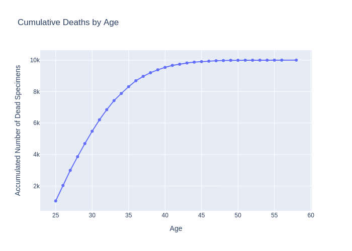

# Day 1

I'm creating the main architecture and all the base systems.

Human currently has 2 needs: sleeping and eating. To try and mimic human life, a turn is 1 hour and I consider a human
can stockpile around 1 day of resources within itself. So a full human can not eat or sleep for 24 turns without any
death risk.

For now, they can only take 1 action which is sleeping. The sleep works like this: if you've just started sleeping, you
gain 1 energy points (equivalent to 1 hour consumption so no gain overall). However, if you were already sleeping, you
gain 3 energy points which is a 2 hours gain. With this equation a human needs to sleep 8/9 hours a day to replenish
its energy entirely.

The brain for now is completely random (Equivalent to no brain).

They only know 1 action which is Sleeping, so all humans spend there all time sleeping. Here is there current success:

Average lifespan: **29 hours**