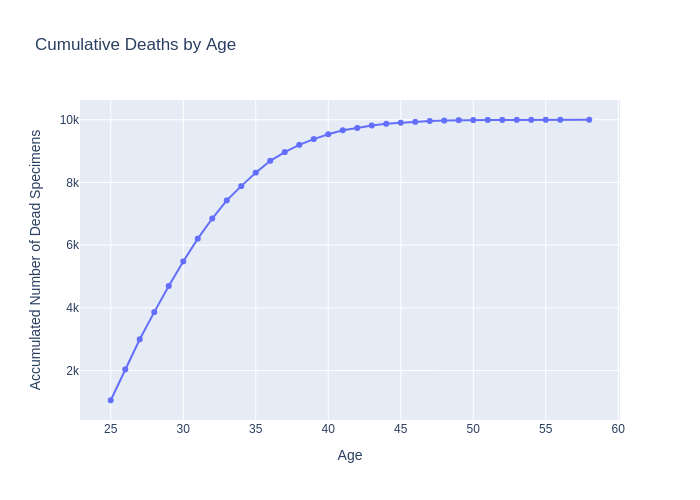
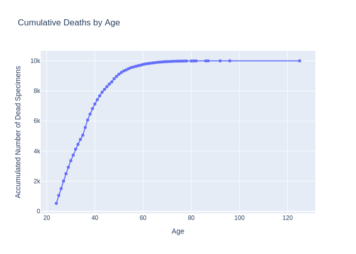

# Day 1

## Step 1

I'm creating the main architecture and all the base systems.

Human currently has 2 needs: sleeping and eating. To try and mimic human life, a turn is 1 hour and I consider a human
can stockpile around 1 day of resources within itself. So a full human can not eat or sleep for 24 turns without any
death risk.

For now, they can only take 1 action which is sleeping. The sleep works like this: if you've just started sleeping, you
gain 1 energy points (equivalent to 1 hour consumption so no gain overall). However, if you were already sleeping, you
gain 3 energy points which is a 2 hours gain. With this equation a human needs to sleep 8/9 hours a day to replenish
its energy entirely.

The brain for now is completely random (Equivalent to no brain).

They only know 1 action which is Sleeping, so all humans spend there all time sleeping. Here is there current success:

Average lifespan: **29 hours**

---

## Step 2

Added 2 new actions: **Hunt** and **Eat**. Still making so that on average a human has all it needs to live, I'm
counting 2 meals a day as the target behaviour. Which means a meal is worth half a day so 12 food_level. And the hunt
probability is 2/24.

- **Hunt**: probability: 1/12 chance to gain 1 rabbit
- **Eat**: If you have a rabbit, eat it to win 12 food_level. If no rabbit available nothing happens

The brain is still completely and desperately empty so all actions are taken randomly

Let's look at the results:

Average lifespan: **36.5 hours**

A small improvement which seems quite logical, now the humans have a way to not die of hunger, which means they can live
longer. It's however quite a small improvement.

At this point I was not sure what was really happening, so I added a new logging system to detect the death cause.
I was pretty sure people were dying of sleep deprivation since if you don't sleep a few time in a row it's a useless
process. However, the result surprised me:

\{
"food": 7151,
"multiple": 1685,
"energy": 1164
\}

The food is still the issue strangely. My explanation is that, since hunting and eating is random. They might die of
2 sources:

- Trying to eat without hunting which lead to famine
- Hunting successfully but never eating your hunt.

On the other hand sleeping only need to happen from time to time consecutively, and since there is only 3 actions for
now. It happens relatively often.

Next steps: replace this useless brain and start the training. I think I will add the knowledge of eating is useless
without food. Once this is done, I will start the training process. As a first iteration,

- Hunt will be a fixed value
- Eat will be a fixed ratio * missing food.
- Sleep will be a fixed ratio * missing energy.

And I will train it to find nice ratios/values. We'll see where this lead our human performance. 
