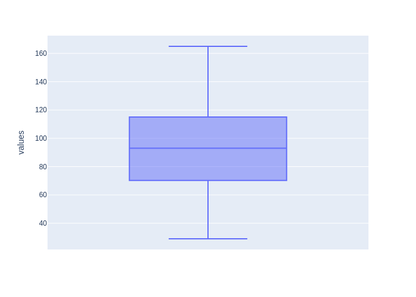
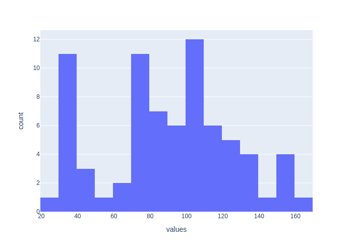
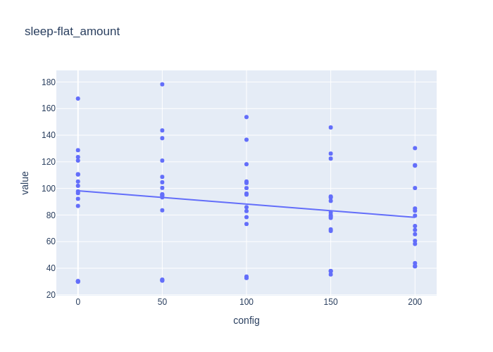
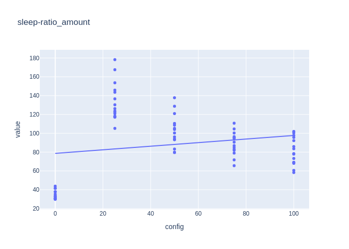
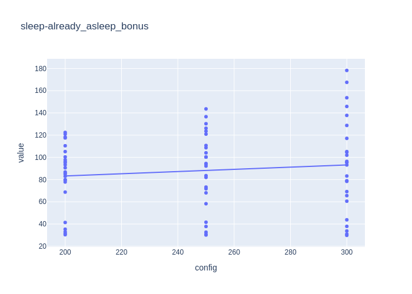

# Day 3

Added a lot of graph to help analyze training results. We now have 2 graphs to check the brut result repartition:

A boxplot 

 

And a grouped histogram 



Allow us to quickly how impactful the training was and the stability of the maximum found. 

However, it was not really helpful to analyse the impact of each parameter, so I also added a chart by brain config. 
This allows us to see trend for each config and help us narrow further the next search zone to optimize all the 
parameters. Allow also to check how good a parameter regardless of the others params.

Here is an exemple on a Sleep training. 

The Sleep brain function looks like this: 

```
def f(sleepiness) = A*sleepiness + B + C*(was_already_sleeping)
```

Results:





In that case, the asleep bonus seems pretty stable over this range, so less interesting. However, the other graphs are 
interesting:
- the flat_amount seems to be pretty consistently decreasing. Which would lead us toward the value 0 solution. Or to do
another run for a range centered around 0.
- The ratio amount is dreadful at 0, it's then quite stable by value and better at lowish values.

With those infos, it seems to look like we can optimize the flat_amount and ratio_amount autonomously and the first one
is better around 0, the second around 20. So we'll make 2 training run with only this parameter varying. Then the bonus
amount is quite dependant (if relevant) on the 2 other factors, so we'll optimize it last.

The final result found is this configuration:
```json
A = 30
B = 0
C = 450
```

The final result are great, we got our first humans dying of old age (for the moment a hard cap to avoid infinite loops)
We also jumped in the average lifespan, **from 74 hours up to 184!**.

The death cause repartition is quite funny:
```json
{"Food": 9890, "Old age": 96, "Energy": 6, "Food & Energy": 8}
```

Food being random it's back to being the main source of death and Sleep death are now nearly non-existent!
```json
{"hunt": 51.87, "sleep": 40.83, "eat": 7.3}
```