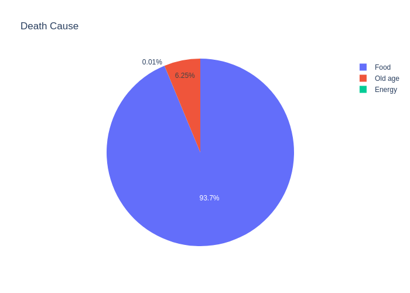
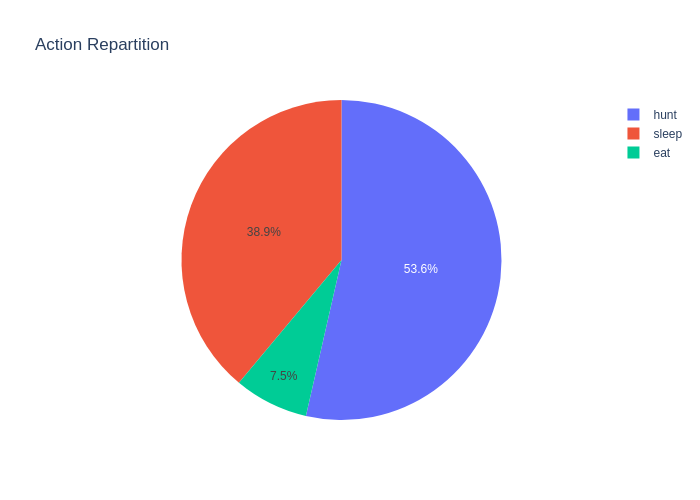

# Day 4

Trained the Hunt Brain. Meaning now no action is random anymore. 
The brain formula is this one:
```
finesse(x) = B - A*x
```
x being the number of rabbits already collected. This means the fewer rabbit you have the more you try to hunt. 
And on the opposite, if you already have a stockpile of rabbits, no need to hunt even more. 

After training, we reached those values:
```
B = 650
A = 50
```

This lead to quite an increase in their performance. **From 184 to 243 hours**, a 32% increase.
Funnily enough, this hunt smartness translated to less energy death: 



This is quite explainable by the fact that it allows even more 'true nights' where if the human stockpiled food he 
won't stop his night in the middle to go and hunt.

The action repartition is quite close to the intended planning:



---

Now that we have base human, it's time to spice things up for them. In the coming days we will add more actions or 
make their environments more complex and see how far they can go. 