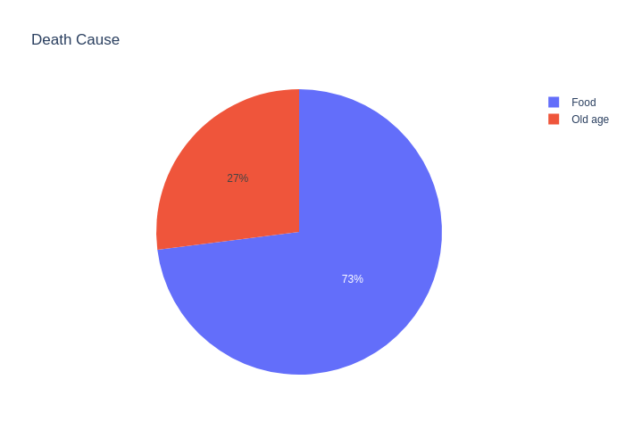
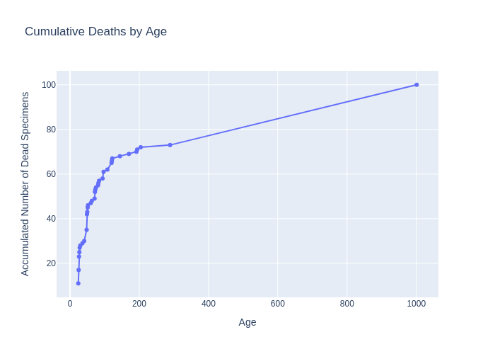
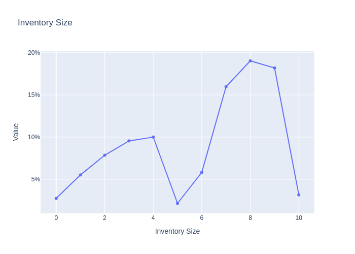
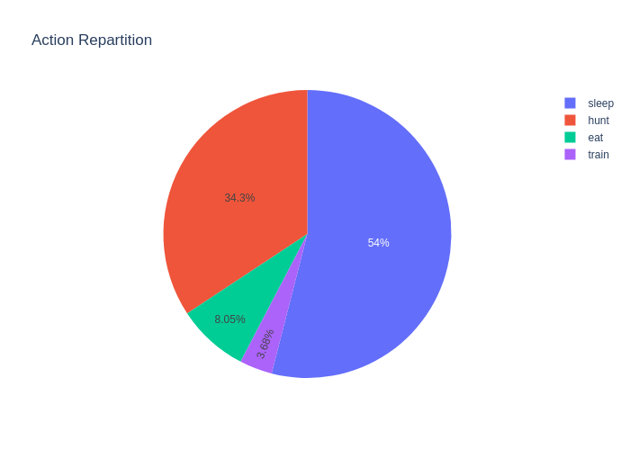
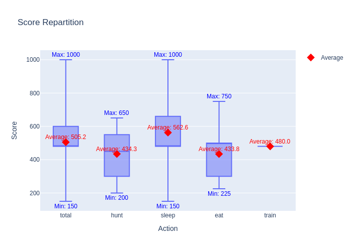
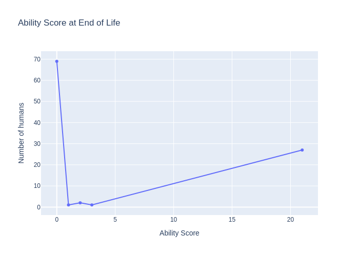
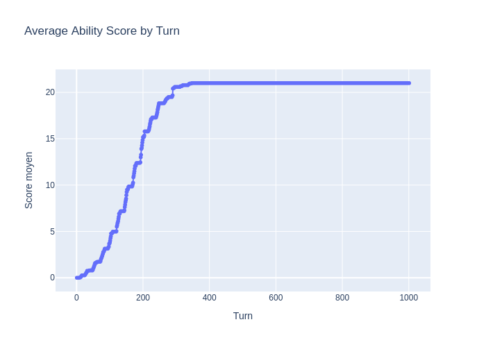

# Day 5: The Training Update

Added a new Action: Training!

The goal of this new intrinsic action was to allow humans to invest in their future. The idea is to sacrifice some time
to gain time in the future. Quite a natural human behaviour.

The way it works for now is: human now have a dexterity score. This score improves other action, and for now it only
improves the Hunt action, by adding 1% of hunt success probability per dexterity score. To limit the efficiency, we
hard coded a limit of 20% attainable this way. Also, a training has only 50% chance to succeed. The maths seemed fair on
paper. 1 hour invested in training was approximately compensated in around 50 turns.

Before training a brain on this function, it first had (without surprise) quite a negative impact on our humans, it
broke the nights meaning they got less rest meaning they were sleeping more time of a day and thus less hunting and thus
dying of hunger. It got crazy and reduced the average lifespan to 40 hours, which was result we had at the beginning of
our training process. How volatile a half-trained brain is. The hubris of man trying to rise above its station.

However, after training results were quite degenerate. The brain function is really simple: A constant value while you
can learn things (Hard cap is not reached) and 0 afterward. The training process set this famous constant amount to 480.

With this system we now have 2 kinds of life, the unlucky at the start one, they don't get enough food or energy so they
can't spare time in training. And for them this update is non-existent. And the lucky one, they get a few rabbits early
on. So they can spare training a bit, which in turns leads in less probability of a dead streak. And make them more or
less immortal until old age strike.

With this new system, we now have **320 hours** average lifespan, we'll need to soon create new ways to dies if I don't
want my computer to start overheating at each run.

We also added a lot of new chart to understand what's happening under the hood. Among those the new inventory chart
help us track equilibrium point in the human behaviour.

This shows us there are 2 equilibrium point. One before training where humans stabilize at 3 items in stock and then
decides to train instead of fetching more. And a new equilibrium point around 8 after they have trained and are more
faithful in their abilities.

---

Another quite helpful one is the action view with way more details, help us the weights of the brain and how it
influences their behaviour:

Finally, some info on the impact of dexterity on their life with first the average score at time of death and then the
evolution of average score with age:

The evolution with age is quite natural and not so surprising. The first one however is fascinating. This means if a
human reaches a point where he is rich enough to start training, then he will manage to capitalize on this first
training to train all the way to the maximum value. Which means I don't even need to put such a high cap to the value.
A hard cap at 5% seems to be enough. So I will adapt the simulation a bit to reflect that. Decreasing the probability
of successful training and increasing the hard cap. This will lead to approximately the same number of time spent
training. But less end game power for those smart humans.
