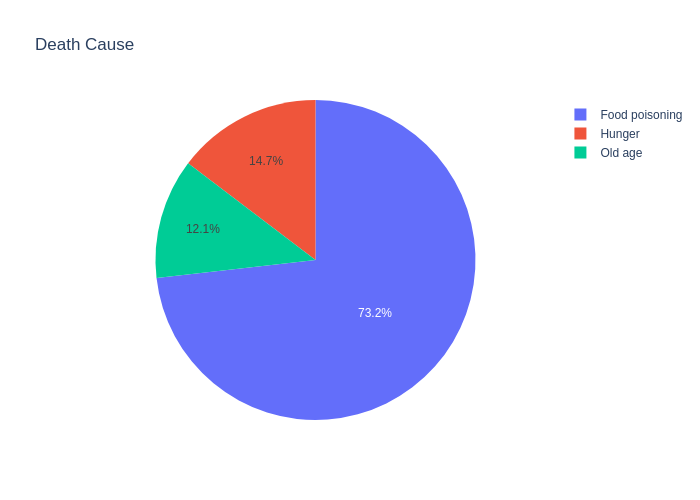
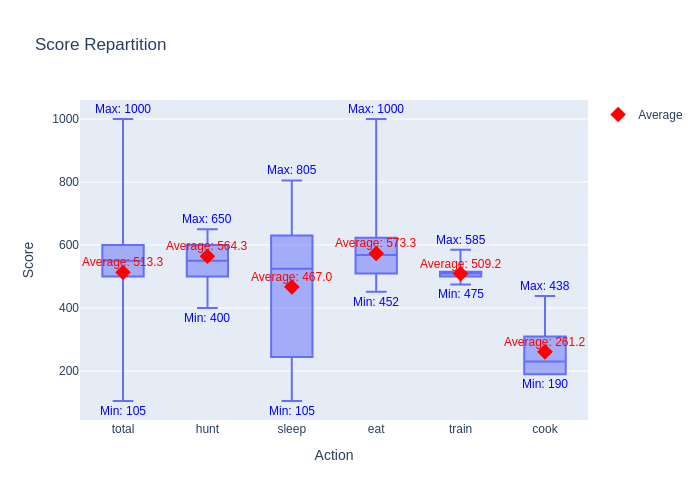
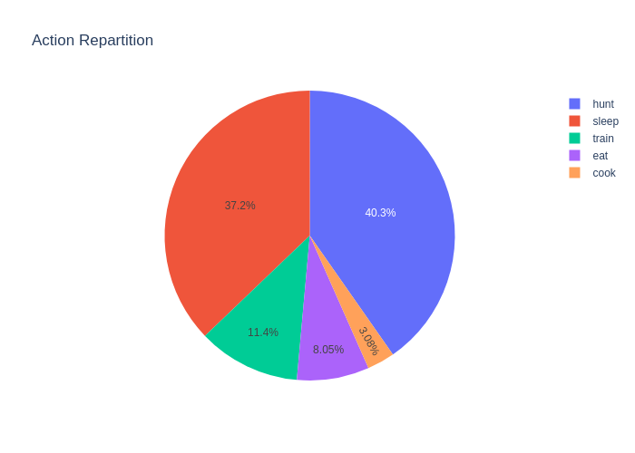
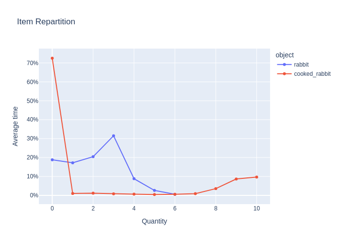
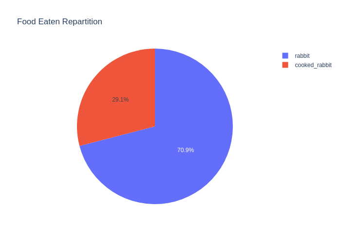
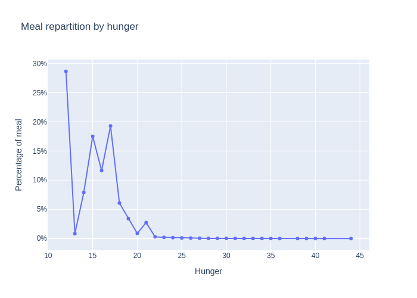

# Day 6: Dangerous Food and Cooking

I indeed had to make life more dangerous for humans, those guys were getting to strong. So, the idea was to push them
into tricky situation and have to make choices. Here the tradeoff is: eating raw food leads to a 5% chance to die
of food poisoning, while cooking the food to avoid that lead to a chance to lose the food (10% chance). Cooking also
take 1 precious hour of time.

This led to me having a pretty hard time optimising the brain. It was quite hard to stabilize the simulation and I had
to tweak most of the brains to manage it completely. Among the new ideas:

1. Training is now a bit less dumb, trying to train only when the vitals are good.
2. Eating is a bit less greedy and waits at least for the human to have 12 hunger points. To avoid spoiling the food.
3. Eating is less likely when you have only uncooked food (flat amount if all the food is uncooked)

The cooking brain formula is:

```python
FLAT_AMOUNT = 310
UNCOOKED_RATIO_AMOUNT = 24
COOKED_RATIO_AMOUNT = -16

finesse = FLAT_AMOUNT + UNCOOKED_RATIO_AMOUNT * uncooked_food_amount + COOKED_RATIO_AMOUNT * cooked_food_amount
```

Without cooking the life expectancy is 191 hours. With cooking, it jumps to **208 hours**.

Here are a few analytics with this system:

- Death Reason: We can see that the stale food is the main explanation of human death



- Action score (A nice way to see the priority of each action compared to one another):



- Action Repartition: it seems to me that human are still not cooking enough



- Inventory content: we are still seeing stats biased a lot by the successful humans. When you finish your training
  without dying, you can live an easy life. Also, the amount of uncooked rabbit doesn't go above 6 since it's then more
  advantageous to cook them.



Finally, some new charts to see how the _Eat action_ behaves.

- Food eaten repartition: quite biased also by the successful and trained humans who end up eating mostly cooked rabbit
  and whom have more meals because of their longer life.



- Meal timing: this chart helped me detect the food spoiling issue. Not sure if it's really useful outside this
  detection.



## Next steps

- I'm probably going to help the cooking step by scaling it with a statistic increasing via training: intelligence.
  This will also force the training to choose which stat it should prioritize. This will reduce the risk of burning the
  food.
- I'm also going to nerf the cooking action, by making it require wood and wood should be gathered beforehand. Wood
  might also be useful later on to build arrows needed to hunt.
- I'm going to increase the probability of successful training to account for the new stats increasing the number of
  actions anyway.